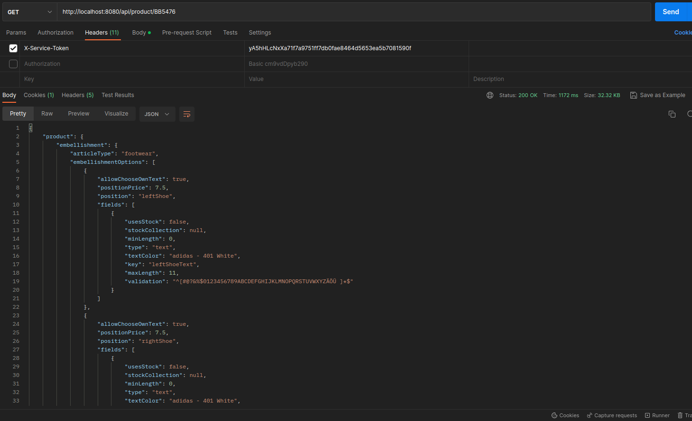

# Product Service

Review Service is a single API endpoint.

It accepts a single ID and returns a product and a review. 

It queries the `review-service` and
the sample Adidas API, for example `https://www.adidas.co.uk/api/products/BB5476`

```
NOTE
Because of the security setup on adidas.co.uk, mainly due to CORS, sending direct requests
isn't possible (e.g. rest template) - but it is possible to fetch the data within a 
browser (manually opening the above sample url)

In this service, what's used to avoid that security feature is fetching the products
with *Selenium* and *ChromeDriver* which will spawn a  browser process and fetch the result.
```

**Product Service includes**

- **REST API endpoint** `/api/product/{product_id}`
- **Service Authentication**
  - within `application.yml` there is a `security` section that defines the service token for invoking the review-service

## Running it locally

For the sake of setting up Docker, please check `review-service`. 

This service wasn't dockerized, mainly due to the time and overhead that Selenium would cause. 

You can run it locally by running the `ProductServiceApplication` class in your IDE, or 
by running `mvn spring-boot:run` from the command line.

#### Sample curl request

Either postman or a curl request will do

    curl -H 'X-Service-Token: yA5hHLcNxXa71f7a9751ff7db0fae8464d5653ea5b7081590f' http://localhost:8080/api/product/BB5476


Response should be the entire JSON from adidas API and the review from the review-service

